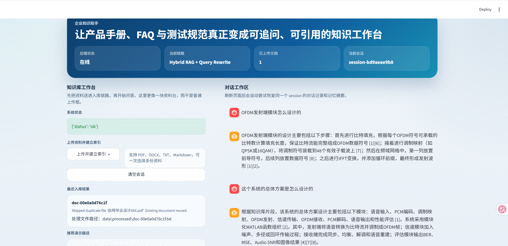
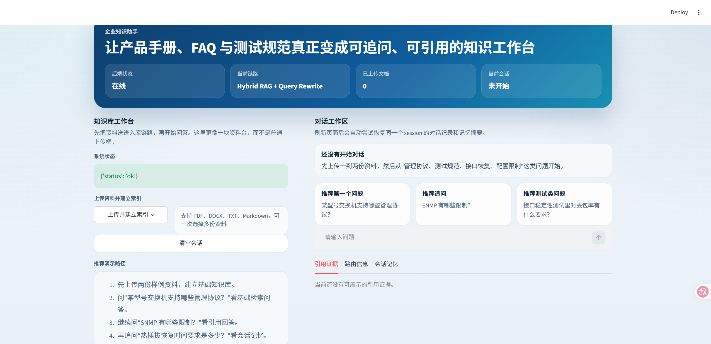

# Telecom Knowledge Assistant

面向通信/电子行业资料场景的企业知识助手 Agent，适合作为 GitHub 展示项目和 AI 应用开发 / Agent / RAG 岗位的简历项目。

这个项目不是通用聊天机器人，而是一个更贴近企业资料场景的知识工作台：

- 支持上传产品手册、FAQ、技术文档、测试规范
- 基于 Hybrid RAG 做知识问答
- 回答时返回引用来源
- 支持会话级多轮记忆
- 使用 KB-first Agent 路由
- 提供 FastAPI API + Streamlit Web 双入口
- 支持本地运行与 Docker 部署





## Highlights

- `Python + FastAPI + Streamlit + LangGraph + ChromaDB`
- 轻量混合检索：`关键词检索 + 本地向量检索 + RRF`
- 上下文感知 Query Rewrite：规则改写优先，检索不足时可选 LLM 改写兜底
- `KB-first` 路由策略：优先查知识库，再决定回答、澄清或回退
- 生成模型使用 `DeepSeek API`
- 向量嵌入使用本地 deterministic embedding，不依赖第二个 embedding API key
- 会话级记忆支持 `SQLite` 持久化，页面刷新和服务重启后仍可恢复

## Project Positioning

适合展示的场景：

- 通信设备厂商内部知识助手
- 网络产品 FAQ / 手册问答系统
- 测试规范与接口稳定性资料助手
- 企业内部资料检索与引用问答 Demo

这个项目刻意控制了复杂度，重点放在：

- RAG 链路完整可运行
- Agent 路由有明确设计
- 前后端联调完整
- 本地可部署、可演示、可写进简历

## Tech Stack

### Backend

- FastAPI
- Pydantic
- LangGraph
- ChromaDB
- SQLite

### Frontend

- Streamlit

### LLM / Retrieval

- DeepSeek API
- Local deterministic embeddings
- Context-aware query rewrite
- Keyword retrieval
- Local vector retrieval
- Reciprocal Rank Fusion (RRF)

## Architecture

```text
User
 ├─ Streamlit Web UI
 └─ FastAPI API
      └─ Chat Service
           ├─ Session Memory (SQLite)
           ├─ KB-first Agent (LangGraph)
           ├─ Query Rewrite
           │    ├─ Hybrid Retriever
           │    │    ├─ Keyword Search
           │    │    ├─ Local Vector Search
           │    │    └─ RRF Fusion
           │    └─ DeepSeek Generation
           └─ Citation Output
```

更详细的架构图见 [docs/architecture.md](docs/architecture.md)。

## Features

当前版本已完成：

- 文档上传与入库
- `pdf / docx / txt / md` 资料解析
- 文本清洗、切分、索引构建
- Chroma 本地向量索引
- 混合检索与 RRF 融合
- 多轮追问的 Query Rewrite
- 基于证据的回答生成
- 引用来源展示
- 会话级多轮记忆
- SQLite 持久化会话恢复
- LangGraph KB-first 路由
- Streamlit 演示界面
- Docker 部署支持

当前刻意未做：

- 多 Agent 协作
- 联网搜索
- OCR / 多模态
- 权限系统
- 长期用户画像

## Repository Structure

```text
.
├─ app/
│  ├─ agent/        # LangGraph 路由与状态流
│  ├─ api/          # FastAPI 路由入口
│  ├─ core/         # 配置、异常、日志、提示词
│  ├─ models/       # Schema 与会话记忆
│  ├─ rag/          # Loader / Chunker / Retriever / Vector Store
│  └─ services/     # Chat / Ingest / Generation / Session 服务
├─ data/
│  ├─ chroma/
│  ├─ processed/
│  ├─ raw/
│  └─ session_memory.db
├─ docs/
├─ samples/
│  └─ telecom_docs/
├─ tests/
├─ web/
├─ .env.example
├─ docker-compose.yml
├─ Dockerfile
└─ requirements.txt
```

## Quick Start

### 1. Install dependencies

```bash
pip install -r requirements.txt
```

### 2. Configure environment variables

```bash
cp .env.example .env
```

Windows PowerShell:

```powershell
Copy-Item .env.example .env
```

然后在 `.env` 中至少配置：

```env
DEEPSEEK_API_KEY=your_deepseek_api_key
```

### 3. Start backend

```bash
uvicorn app.api.main:app --reload
```

API docs:

- `http://127.0.0.1:8000/docs`

### 4. Start frontend

```bash
streamlit run web/streamlit_app.py
```

Web UI:

- `http://127.0.0.1:8501`

## Docker

准备好 `.env` 后运行：

```bash
docker compose up --build
```

启动后：

- FastAPI: `http://127.0.0.1:8000`
- Streamlit: `http://127.0.0.1:8501`

## API Endpoints

- `GET /health`：健康检查
- `GET /`：服务说明
- `POST /api/v1/ingest/file`：上传文件并建立索引
- `POST /api/v1/chat`：基于知识库问答
- `GET /api/v1/chat/session/{session_id}`：恢复历史会话与记忆摘要

`POST /api/v1/chat` request example:

```json
{
  "question": "某型号交换机支持哪些管理协议？",
  "session_id": "session-optional"
}
```

## Session Memory

当前实现的是：

- 会话级短期记忆
- 前端 URL 查询参数中的 `session_id` 恢复
- 基于 `SQLite` 的本地持久化

这意味着：

- 刷新页面后，会话可恢复
- 后端服务重启后，会话仍可恢复
- 但它不是长期用户画像系统

## Query Rewrite

当前项目实现了轻量的上下文感知 Query Rewrite：

- 优先使用规则式改写补全代词、省略主语和追问上下文
- 当规则改写后的检索结果不足时，可选触发一次 LLM 改写兜底
- 改写结果会参与 Hybrid RAG 检索，并在前端路由信息中展示

适合处理的问题包括：

- `那它支持哪些协议？`
- `继续问：热插拔恢复时间要求是多少？`
- `这个限制主要体现在哪？`

## Demo Materials

仓库内置了两份通信/电子行业样例资料：

- [samples/telecom_docs/device_management_guide.md](samples/telecom_docs/device_management_guide.md)
- [samples/telecom_docs/interface_stability_test_spec.md](samples/telecom_docs/interface_stability_test_spec.md)

推荐演示问题：

1. `某型号交换机支持哪些管理协议？`
2. `SNMP 有哪些限制？`
3. `接口稳定性测试里对丢包率有什么要求？`
4. `继续问：热插拔恢复时间要求是多少？`

完整演示脚本见 [docs/demo-script.md](docs/demo-script.md)。

## Testing

```bash
pytest
```

当前测试覆盖：

- 文本切分
- 关键词检索
- 轻量重排
- Query Rewrite
- 引用格式化
- 异常模型
- 会话记忆恢复
- Session API

## References

本项目没有直接照搬开源仓库，而是做了轻量组合：

- 项目结构参考：`agent-service-toolkit`
- RAG 模块拆分参考：`rag-document-intelligence`
- Agent 编排参考：`rag-langgraph-agent`

## Future Improvements

- 增加更真实的企业文档集
- 增加云端部署配置
- 增加更强的澄清策略
- 增加长期记忆或用户画像
- 从 Streamlit 升级到 React 前端
