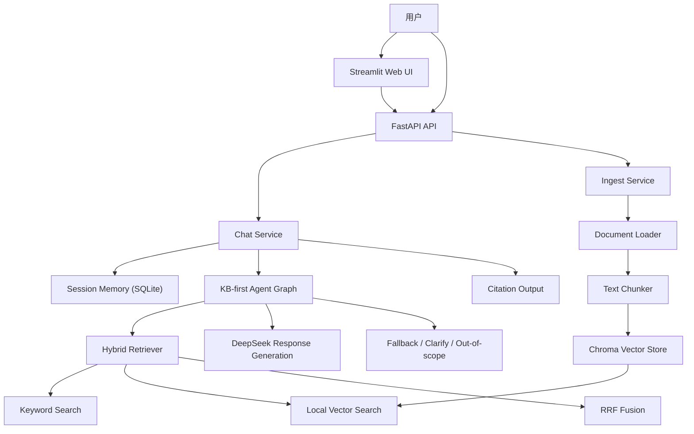

# 架构图

```mermaid
flowchart TD
    U["用户"] --> W["Streamlit Web UI"]
    U --> A["FastAPI API"]

    W --> A
    A --> C["Chat Service"]
    A --> I["Ingest Service"]

    I --> L["Document Loader"]
    L --> K["Text Chunker"]
    K --> V["Chroma Vector Store"]

    C --> M["Session Memory (SQLite)"]
    C --> G["KB-first Agent Graph"]

    G --> R["Hybrid Retriever"]
    R --> KS["Keyword Search"]
    R --> VS["Local Vector Search"]
    R --> RF["RRF Fusion"]

    G --> O["DeepSeek Response Generation"]
    G --> F["Fallback / Clarify / Out-of-scope"]

    V --> VS
    C --> Q["Citation Output"]
```

## 说明

- 文档入库链路：`上传 -> 解析 -> 切分 -> 向量入库`
- 问答链路：`检索 -> 路由 -> 生成 -> 引用返回`
- Agent 策略：`KB-first`
- 记忆策略：会话级短期记忆，使用 `SQLite` 做本地持久化
